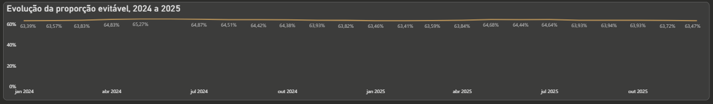
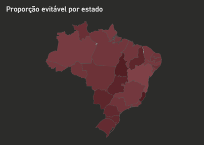
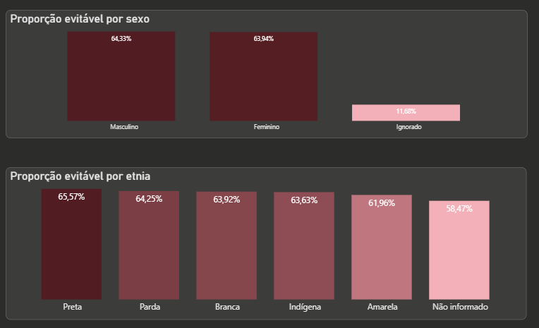
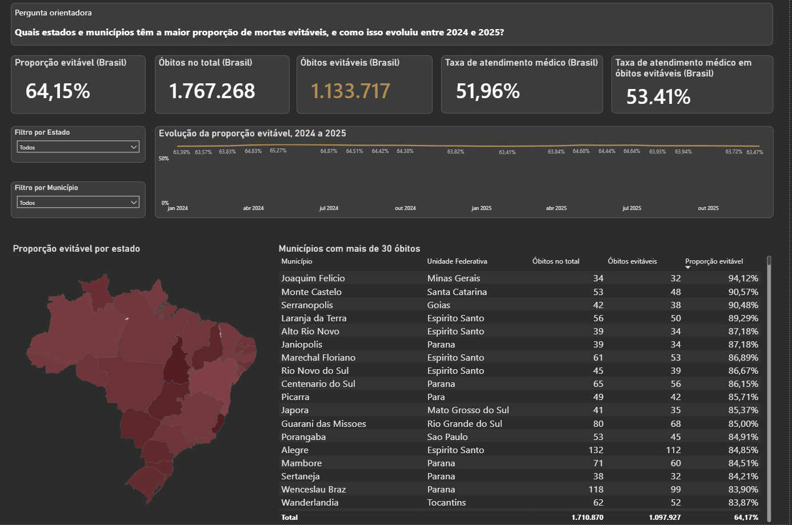
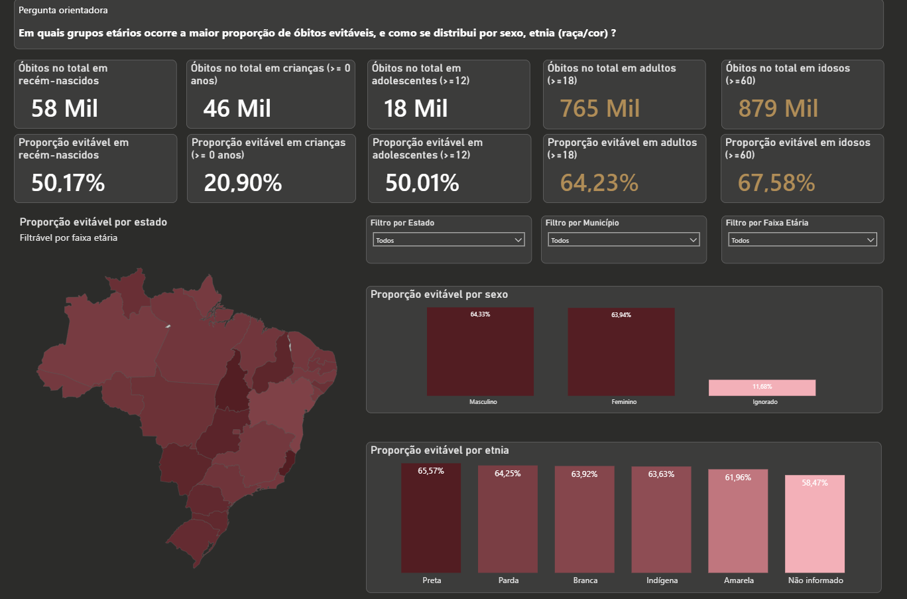
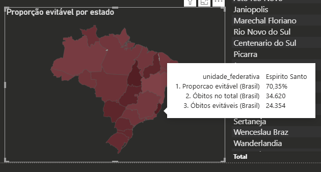
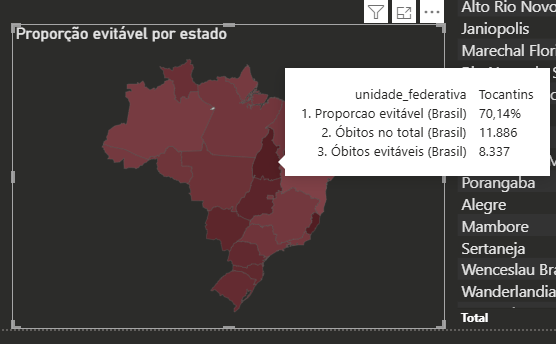

# Mortalidade evitável no Brasil

> **Analista de dados:** Ana Letícia Cabral do Rosário
> **Data de início:** [08/07/2026] — Coleta dos dados
> **Data de conclusão:** [14/08/2026] 
> **Status do projeto:** 🟢 Concluído 
> **Link do dashboard:** https://app.powerbi.com/view?r=eyJrIjoiZmVkYWY3NjktMDNhYi00YmEyLTk5MmYtMjY5NmU0NmZhYzIxIiwidCI6Ijk0MDBmNTdkLWIwY2EtNGQzOC1iNzA5LWYxYTA3ZDIyMTY4NyJ9

---

## 1. Contexto e Objetivo

Esta análise cobre óbitos registrados no SIM entre 2024 e 2025, em todo o território nacional, cobrindo idades de até 74 anos.

**Nota da analista:** este projeto foi desenvolvido como exercício de estudo, 
para aplicar na prática os conhecimentos de Power BI adquiridos durante 
meu estágio. Sugestões, alertas ou pontos de melhoria são muito bem-vindos! Fico à disposição para conversar.

**Definição de mortalidade evitável (referencial SUS):**

> "As causas de mortes evitáveis ou reduzíveis são definidas como aquelas 
> preveníveis, total ou parcialmente, por ações efetivas dos serviços de 
> saúde que estejam acessíveis em um determinado local e época."
>
> — Lista de causas de mortes evitáveis por intervenção do Sistema Único 
> de Saúde do Brasil

**Pergunta de negócio / problema a resolver:**
1. Quais estados e municípios têm a maior proporção de mortes evitáveis, e como isso evoluiu entre 2024 e 2025?
2. Em quais grupos etários ocorre a maior proporção de óbitos evitáveis, e como se distribui por sexo e raça/cor?
3. Quais são os grupos prioritários para intervenção, onde e por quê?

**Por que isso importa:**
O objetivo desta análise é traçar um panorama inicial da mortalidade 
evitável registrada entre 2024 e 2025, fornecendo subsídios para que 
agentes de saúde pública identifiquem os fatores associados a cada 
contexto e orientem ações voltadas à redução dessas taxas.

---

## 2. Dados

### Fonte principal

| Item | Detalhe |
|---|---|
| Fonte | SIM (Sistema de Informações sobre Mortalidade) |
| Período coberto | 2024–2025 |
| Nº de registros | 3.060.100 |
| Nº de registros filtrados | 1.767.268 |
| Granularidade | Por óbito |
| Dicionário de dados | [Dicionário SIM](Dicionario_SIM_2025.pdf) |

### Fontes complementares

| Fonte | Uso |
|---|---|
| CID-10 | Classificação de diagnósticos e condições de saúde|
| CNE (Cadastro Nacional de Estabelecimentos de Saúde) | Dados de estabelecimentos de saúde |
| IBGE | Códigos e dados municipais |
| Artigo 1 – Mortes Evitáveis SUS (2007) | Referencial de classificação de evitabilidade |
| Artigo 2 – Mortes Evitáveis SUS Atualizado (2011) | Referencial de classificação de evitabilidade |

**Limitações conhecidas dos dados:**
- SIM: várias colunas com valores nulos acima de 70%.
- CID-10: no momento, nenhuma limitação identificada.
- CNE: cobertura temporal de ago/2005 a nov/2025.
- IBGE: dados referentes a 2024.
- Artigo 1 – Mortes Evitáveis SUS: artigo de 2007.
- Artigo 2 – Mortes Evitáveis SUS Atualizado: artigo de 2011.

---

## 3. Ferramentas e Metodologia

[Ferramentas e metodologia](secao-3-ferramentas-metodologia.md)

---

## 4. Achados preliminares

### 4.1 Primeira descoberta  — panorama nacional

Aproximadamente 64,15% dos óbitos registrados no Brasil ocorreram por causas que poderiam ter sido evitadas, segundo os critérios de evitabilidade do Ministério da Saúde. Entre esses óbitos evitáveis, 53,41% tiveram atendimento médico continuado registrado durante a enfermidade que ocasionou a morte.

Esse achado levanta questões que merecem investigação futura: se mais da metade dos óbitos evitáveis ocorreu apesar de haver atendimento médico, que tipo de falha assistencial pode estar por trás desses casos — diagnóstico tardio, tratamento inadequado, ou descontinuidade no cuidado? E, quanto à outra parcela, sem atendimento registrado, o que explica essa ausência — falta de acesso, subnotificação, ou óbito antes de qualquer contato com o sistema de saúde?

Filtro metodológico aplicado: ao restringir a análise a municípios com pelo menos 30 óbitos registrados, o índice nacional apresenta leve aumento, passando para 64,17%. Esse filtro é necessário para evitar distorções estatísticas: em cidades muito pequenas, qualquer variação no número absoluto de mortes pode gerar percentuais extremos e não representativos, o que poderia levar a interpretações alarmistas ou equivocadas por parte de quem consome a análise pela primeira vez.

Com essa regra aplicada, o município de Joaquim Felício (MG) destacou-se com a maior proporção de mortes evitáveis do país: 94,12% (32 dos 34 óbitos totais registrados).

Na análise por estado, Espírito Santo e Tocantins lideraram as maiores proporções de mortes evitáveis, com 70,35% e 70,14%, respectivamente.

Ao observar a evolução temporal do indicador nacional entre 2024 e 2025, a proporção mensal variou apenas entre 63% e 65% — não havendo, portanto, variação significativa ao longo do período analisado.

### 4.2 Segunda descoberta — perfil demográfico
 
Adultos e idosos representam as faixas etárias com os maiores volumes de mortalidade e as maiores proporções de óbitos evitáveis. Do total de 765 mil mortes registradas entre adultos, 64,23% ocorreram por causas evitáveis. Entre os idosos de até 74 anos — faixa etária limite dos critérios de evitabilidade aplicados — esse índice é ainda mais expressivo: das 879 mil mortes contabilizadas, 67,58% poderiam ter sido evitadas.
 
Não foram observadas diferenças significativas nas proporções de óbitos evitáveis entre os recortes de sexo e raça/cor: em ambas as variáveis, a taxa manteve-se na faixa dos 60%.

### Questões para investigação futura
 
- Que fatores explicam óbitos evitáveis mesmo com atendimento médico registrado (falha de diagnóstico, tratamento ou continuidade do cuidado)?
- Por que uma parcela dos óbitos evitáveis não teve atendimento médico registrado — falta de acesso, subnotificação, ou ausência real de contato com o sistema de saúde?
 
---

## 5. Resultados / Insights
 
*Os valores abaixo refletem o filtro metodológico de idade (óbitos com idade em anos completos até 74 anos, critério de evitabilidade — seção 3.2). O filtro de municípios com pelo menos 30 óbitos (seção 4.1) não foi aplicado aqui; ele é específico da análise de ranking municipal.*
 
| Métrica | Valor | Observação |
|---|---|---|
| Proporção evitável (Brasil) | 64,15% | Mais da metade das mortes **registradas** no SIM poderiam ter sido totalmente ou parcialmente prevenidas. |
| Óbitos no total (Brasil) | 1.767.268 | |
| Óbitos evitáveis (Brasil) | 1.133.717 | |
| Recém-nascido (óbitos evitáveis) | 50,17% | De 58 mil registros |
| Crianças (óbitos evitáveis) | 20,90% | De 46 mil registros |
| Adolescentes (óbitos evitáveis) | 50,01% | De 18 mil registros |
| Adultos (óbitos evitáveis) | 64,23% ⚠️ | De 765 mil registros — proporção alta |
| Idosos (óbitos evitáveis) | 67,58% ⚠️ | De 879 mil registros — proporção alta |
| Taxa de atendimento médico (Brasil) | 51,96% | De 1.767.268 registros |
 
**Legenda:** ⚠️ indica proporção de óbitos evitáveis notavelmente alta em relação às demais faixas etárias.

## 6. Storytelling: do Macro ao Micro
 
Utilizando a prática de storytelling, foram desenvolvidas medidas em DAX capazes de identificar os principais insights dos dados por meio de uma abordagem analítica em cascata — do macro para o micro: primeiro o estado com a situação mais crítica, em seguida o município mais impactado dentro desse estado e, por fim, as principais características do perfil das vítimas. Essa abordagem permite extrair insights mais precisos e acionáveis do que uma análise agregada isolada.
 
### 6.1 Panorama nacional (macro)
 
A análise dos dados do Sistema de Informações sobre Mortalidade (SIM) no Brasil revela um cenário crítico: **64,15%** dos óbitos registrados no país poderiam ser prevenidos por meio de ações efetivas do sistema de saúde.
 
### 6.2 Contexto estadual
 
Ao afunilar a análise para o estado do Espírito Santo, o indicador se mostra ainda mais severo que a média nacional. Do total de 34.620 mortes registradas no estado, **70,35%** ocorreram por motivos preveníveis.
 
### 6.3 Foco municipal (micro)
 
Identificando os pontos críticos dentro do território capixaba, o município de Vila Pavão destacou-se negativamente. Apesar de possuir um volume absoluto baixo de registros (baixa amostragem), a cidade apresentou a maior proporção de mortalidade evitável de todo o estado.
 
### 6.4 Perfil demográfico e cenário dos óbitos
 
Investigando as particularidades do município de Vila Pavão, mapeou-se o seguinte comportamento para os óbitos evitáveis:
 
- **Perfil principal:** a maioria das vítimas pertencia ao sexo masculino, à raça/cor parda e à faixa etária idoso.
- **Local do óbito:** o cenário predominante dessas ocorrências foi o domicílio.
- **Assistência à saúde:** evidenciou-se uma grave lacuna no acompanhamento médico, já que a maioria dos registros de assistência médica continuada está como "Não informado".
- **Evitabilidade:** o motivo de evitabilidade que mais se destacou na região foi "Reduzível por ações adequadas de promoção à saúde".

---

## 7. Visualizações

**Gráfico 1** — Evolução da proporção evitável, 2024–2025

**Gráfico 2** — Proporção evitável por estado

**Gráficos 3, 4 ** — Proporção evitável pelo perfil das vítimas

**Análise geográfica**

**Perfil das vítimas**

**Monitoramento de prioridades**

---

## 8. Conclusões e Recomendações
 
### 8.1 Conclusão
 
Os artigos do Ministério da Saúde utilizados como referência técnica, escritos por pesquisadores e profissionais da área, tendo o SUS como referencial na época, mas cujos critérios se aplicam a qualquer estabelecimento de saúde, definem óbito evitável como aquele que poderia ter sido total ou parcialmente prevenido caso o paciente tivesse recebido atenção efetiva do sistema de saúde. Esse conceito é amplo, mas pode ser entendido, entre outros pontos citados nos artigos, como: ações efetivas de imunoprevenção, atenção à mulher na gestação e ao recém-nascido, diagnóstico e tratamento adequados, e promoção da saúde.
 
É preocupante que mais da metade dos óbitos registrados no SIM nos dois anos analisados se enquadrem nesses critérios de evitabilidade. Chama ainda mais atenção que estados como Espírito Santo e Tocantins — os dois com maior proporção no gráfico construído nesta análise — estejam acima da proporção nacional.
 
**Gráfico 6** — Proporção evitável nacional
 

 
**Gráfico 7** — Proporção evitável, Espírito Santo
 

 
**Gráfico 8** — Proporção evitável, Tocantins
 

 
### 8.2 Recomendações
 
#### Ao Ministério da Saúde
 
Os artigos usados como base são antigos. Recomenda-se a produção de estudos mais recentes, que:
 
- Incorporem tecnologias atuais de monitoramento e diagnóstico;
- Investiguem se surgiram novas causas de óbito evitável e quais causas seguem sendo as mais difíceis de prevenir;
- Ampliem o referencial para além do SUS, incluindo hospitais privados, permitindo comparar se há diferença significativa de evitabilidade entre os setores público e privado, e investigar as causas dessa diferença.
#### A profissionais e gestores de saúde
 
- Priorizar ao máximo o cuidado e a atenção aos pacientes, evitando falhas de comunicação e conduta ética;
- Reportar falhas tecnológicas identificadas aos gestores responsáveis;
- Mapear, no caso dos gestores, as lacunas dentro de sua responsabilidade que, se corrigidas, poderiam salvar vidas;
- Recorrer a ferramentas de Business Intelligence, em cenários de difícil monitoramento de recursos, leitos e pacientes, para embasar decisões com dados, não apenas percepção.
#### Ao Espírito Santo, com atenção ao município de Vila Pavão
 
Os dados de Vila Pavão mostram que 71% dos óbitos evitáveis do município ocorreram em homens, e que idosos são a faixa etária mais afetada (46% dos casos, com adultos logo atrás, em 37,5%). Quanto à causa, o infarto agudo do miocárdio é a causa isolada mais recorrente entre os óbitos evitáveis do município (12,5% do total — o maior volume entre todas as causas registradas, embora não represente a maioria).
 
Recomenda-se que o estado investigue quais ações de promoção à saúde podem reduzir os óbitos evitáveis em homens idosos, com foco no fortalecimento do acompanhamento médico contínuo dessa população (controle de pressão arterial, colesterol, diabetes e acesso rápido a atendimento cardiovascular de urgência), já que doenças cardiovasculares em conjunto (IAM, doença isquêmica do coração, hemorragia intracerebral, outros infartos cerebrais e hipertensão) somam cerca de 29% dos óbitos evitáveis do município.
 
É chamativo que um município do porte de Vila Pavão apresente a maior proporção de óbitos evitáveis do estado. Vale a ressalva metodológica: o número absoluto de óbitos evitáveis registrados no período é pequeno (24 casos), o que faz cada caso adicional impactar significativamente as proporções observadas. Por isso, recomenda-se acompanhar essa tendência em anos seguintes antes de tratá-la como padrão consolidado. Ainda assim, o tamanho reduzido do município é justamente o que torna o problema mais solucionável: uma população pequena é mais fácil de monitorar de perto do que uma grande.

---

## 9. O que Aprendi Nesta Análise

Aprendi muita coisa nesta análise, desde o que leva uma doença ou condição 
de saúde a ser considerada evitável — antes eu achava que uma morte só 
seria considerada evitável por causas externas, como violência. Lendo os 
artigos, compreendi que vai muito além disso: envolve como a sociedade 
está em termos de assistência médica e suas tecnologias, algo fundamental 
para todos nós.

Do lado técnico, aprendi que a escolha de como calcular certas métricas 
é fundamental. Se a amostragem é pequena, calcular uma proporção nela 
(parte de um todo) pode distorcer totalmente uma análise se eu não for 
criteriosa — uma amostragem muito baixa pode distorcer tanto o numerador 
quanto o denominador do cálculo. Nas situações em que isso foi necessário, 
é de suma importância **destacar as limitações** com clareza.